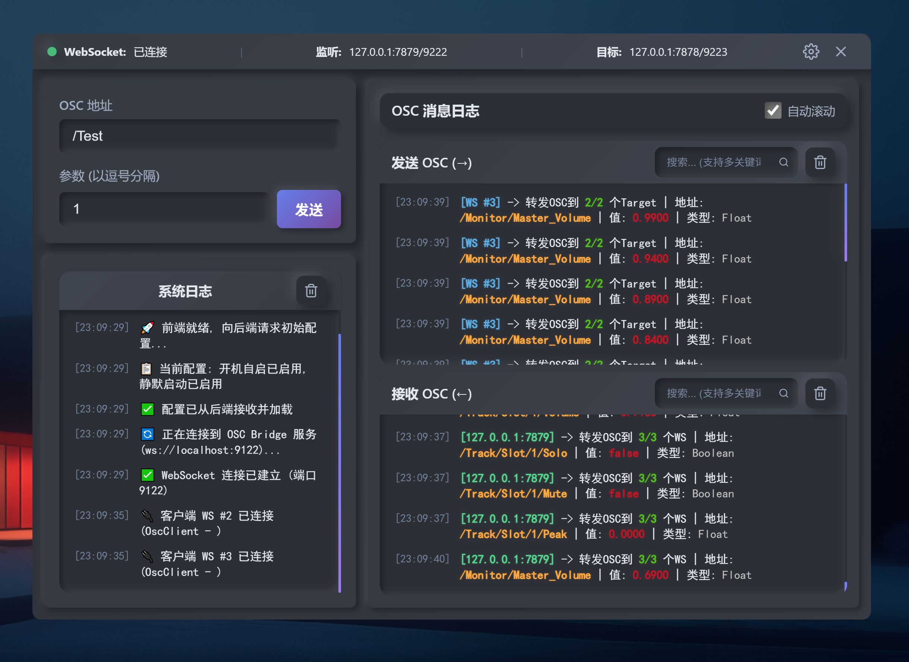
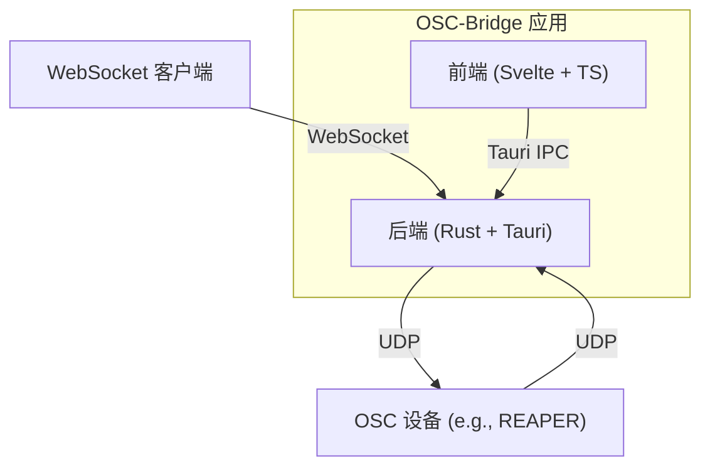

# 🎵 OSC-Bridge - 现代化OSC桥接与控制面板

[](https://tauri.app/)
[](https://www.rust-lang.org/)
[](https://svelte.dev/)
[](https://www.typescriptlang.org/)
[](https://github.com/GohardSGG/OSC-Bridge/actions/workflows/release.yml)

一个基于 Tauri, Rust 和 Svelte 构建的现代化、高性能 OSC（Open Sound Control）桥接工具，专为需要可靠、低延迟通信的音频制作和现场控制场景设计。

<div align="center">
  
</div>

## 📖 项目简介

OSC-Bridge 是一个轻量级的桌面应用程序，它在 WebSocket 客户端（如网页控制端）和需要 OSC 控制的设备或软件（如 REAPER 等数字音频工作站）之间建立起一个高效、双向的通信桥梁。

通过其简洁直观的控制面板，用户可以轻松地发送测试指令、实时监控所有OSC通信数据流，并对应用的各项行为进行深度配置。

### 🎯 核心功能

- **🚀 高性能Rust后端**：完全由Rust构建，提供低延迟、高可靠性的桥接服务。
- **🔄 双向OSC通信**：同时支持从WebSocket转发到UDP，以及从UDP转发到WebSocket。
- **🖥️ 现代化监控界面**：使用 **Svelte** 和 **Tailwind CSS** 构建，提供清晰流畅的实时日志监控。
- **🔧 动态配置**：通过图形化界面轻松添加或删除监听端口和转发目标。
- **🌍 国际化支持 (i18n)**：支持中英文界面切换。
- **⚙️ 系统集成**：
  - **置顶窗口**：可将窗口设置为始终位于顶层。
  - **开机自启**：可配置应用随系统自动启动。
  - **静默启动**：启动时自动隐藏主窗口，仅在后台运行。
  - **系统托盘**：提供托盘图标，方便快速访问和控制。
- **✨ 用户体验优化**：
  - **UI缩放**：自动适配系统DPI，并支持用户在设置中手动调节界面大小。
  - **响应式布局**：在窄窗口下自动折叠侧边栏，优化空间利用。
  - **可调面板**：支持拖拽调整日志面板的高度比例。

## 🏗️ 技术架构



## 🚀 功能特性

### 🎛️ 控制面板
- **OSC 消息注入器**：内置一个简易的OSC消息发送工具，用于快速测试。
- **实时流量监视器**：
    - **方向指示**：清晰地区分传出 (TX) 和传入 (RX) 的消息。
    - **智能自动滚动**：在自动滚动的状态下，如果用户向上滚动查看历史，新日志不会强制将视图拉回底部，体验更自然。
    - **高级搜索**：支持实时筛选日志。
- **连接状态**：实时显示WebSocket的连接状态。

### ⚙️ 设置与配置
- **动态端口管理**：在设置弹窗中，可以随时添加或删除监听的UDP端口和需要转发到的UDP目标地址。
- **跨平台配置保存**：
  - **Windows**: 所有配置更改都会自动保存到**可执行文件同目录**下的 `config.json` 文件中 (需要管理员权限)。
  - **macOS/Linux**: 配置保存于用户专属的**应用配置目录**中。
- **首次运行**：应用首次启动时，会自动创建一个默认的 `config.json` 文件。
- **系统托盘菜单**：
  - 显示/隐藏主窗口。
  - 一键启用/禁用开机自启和静默启动。
  - 退出应用。

## 🛠️ 安装与使用

### 环境要求
- **Node.js & npm** (用于前端构建)
- **Rust & Cargo** (最新稳定版)
- **操作系统**: Windows, macOS, Linux (已通过GitHub Actions进行跨平台构建验证)

### 开发模式

1. **克隆项目**
   ```bash
   git clone https://github.com/GohardSGG/OSC-Bridge.git
   cd OSC-Bridge
   ```

2. **安装依赖**
   ```bash
   npm install
   ```

3. **运行开发服务器** (在 Windows 上，请使用**管理员权限**的终端)
   ```bash
   npm run dev
   ```

### 生产构建

 **本地构建**
   ```bash
   npm run build
   ```
   构建产物（安装包）将自动整理到项目根目录的 `Build/Release/` 文件夹中。

## 🔧 配置说明

- **Windows**: 配置文件 `config.json` 位于可执行文件同目录下。
- **macOS**: 配置文件位于 `~/Library/Application Support/com.osc-bridge.app/`。
- **Linux**: 配置文件位于 `~/.config/com.osc-bridge.app/`。

**示例 `config.json`:**
```json
{
  "ListenPorts": [
    "127.0.0.1:7879",
    "127.0.0.1:9222"
  ],
  "TargetPorts": [
    "127.0.0.1:7878",
    "127.0.0.1:9223"
  ],
  "WS": [
    "ws://localhost:9122"
  ]
}
```

## 🤝 贡献指南

我们欢迎所有形式的贡献！请遵循以下步骤：

1. **Fork** 本仓库。
2. 创建您的特性分支 (`git checkout -b feature/AmazingFeature`)。
3. 提交您的更改 (`git commit -m 'feat: Add some AmazingFeature'`)。
4. 推送到分支 (`git push origin feature/AmazingFeature`)。
5. 开启一个 **Pull Request**。

## 📝 更新日志

### v1.1.0 (2025-XX-XX)
- 🚀 **前端重构**: UI 框架从 Vue 迁移到 **Svelte**，并引入 **Tailwind CSS**，提升了开发体验和运行时性能。
- 🌍 **国际化**: 新增中/英文语言支持。
- ✨ **UI/UX 优化**:
  - 新增“始终置顶”功能。
  - 新增 UI 缩放功能，自动适配系统 DPI 并支持用户手动调节。
  - 实现响应式布局，在窄屏下自动隐藏侧边栏。
  - 流量监视器面板支持拖拽调整高度。
  - 实现了更智能的“自动滚动”逻辑。
  - 全面美化了滚动条样式。
- 🔧 **配置逻辑优化**:
  - **Windows**: 应用启动时会自动请求管理员权限，确保配置文件能正确读写。
  - **macOS/Linux**: 配置文件迁移至用户专属的应用配置目录，遵循系统规范。
- 🤖 **CI/CD 优化**: 全面适配新的项目结构和构建流程。

## 📄 许可证

本项目采用 MIT 许可证 - 查看 [LICENSE.md](LICENSE.md) 文件了解详情。

## 🙏 致谢

- [Tauri](https://tauri.app/) - 强大的桌面应用框架。
- [Svelte](https://svelte.dev/) - 颠覆性的前端编译器。
- 所有为本项目提供灵感和帮助的开源社区。

---

<div align="center">

**如果这个项目对你有帮助，请给它一个 ⭐！**

[🐛 报告问题](https://github.com/GohardSGG/OSC-Bridge/issues) • [💡 功能建议](https://github.com/GohardSGG/OSC-Bridge/issues)

</div>
