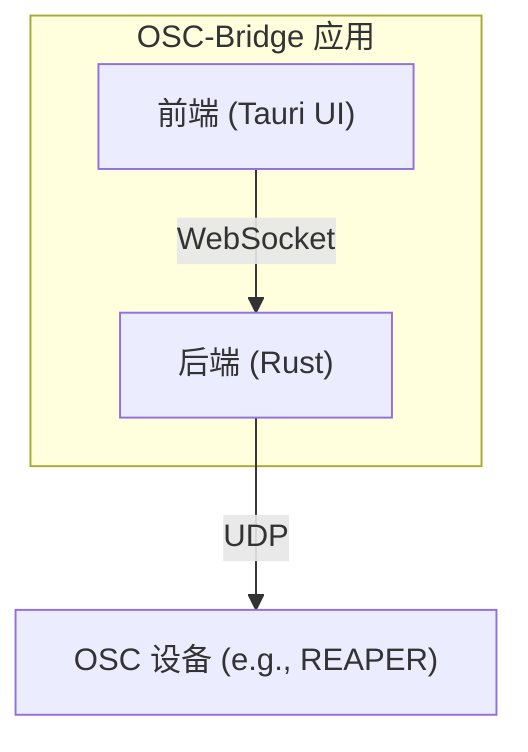

# 🎵 OSC-Bridge - 现代化OSC桥接与控制面板

[](https://tauri.app/)
[](https://www.rust-lang.org/)
[](https://www.typescriptlang.org/)
[](https://github.com/GohardSGG/OSC-Bridge/actions/workflows/release.yml)

一个基于 Tauri 和 Rust 构建的现代化、高性能 OSC（Open Sound Control）桥接工具，专为需要可靠、低延迟通信的音频制作和现场控制场景设计。

## 📖 项目简介

OSC-Bridge 是一个轻量级的桌面应用程序，它在 WebSocket 客户端（如网页控制端）和需要 OSC 控制的设备或软件（如 REAPER 等数字音频工作站）之间建立起一个高效、双向的通信桥梁。

通过其简洁的控制面板，用户可以轻松地发送测试指令、实时监控所有OSC通信数据流，并对应用的启动行为进行配置。

### 🎯 核心功能

- **🚀 高性能Rust后端**：完全由Rust构建，提供低延迟、高可靠性的桥接服务。
- **🔄 双向OSC通信**：同时支持从WebSocket转发到UDP，以及从UDP转发到WebSocket。
- **🖥️ 现代化监控界面**：使用Vue和TypeScript构建，提供清晰的实时日志监控。
- **🔧 动态配置**：通过图形化界面轻松添加或删除监听端口和转发目标。
- **⚙️ 系统集成**：
  - **开机自启**：可配置应用随系统自动启动。
  - **静默启动**：启动时自动隐藏主窗口，仅在后台运行。
  - **系统托盘**：提供托盘图标，方便快速访问和控制。

## 🏗️ 技术架构

项目的架构现已完全统一为 Tauri，不再依赖外部的 Node.js 服务。



## 🚀 功能特性

### 🎛️ 控制面板
- **OSC 消息发送**：内置一个简易的OSC消息发送工具，用于快速测试。
- **实时日志**：
    - **方向指示**：清晰地区分发送 (→) 和接收 (←) 的消息。
    - **来源与目标**：明确展示每一条消息的来源与去向。
    - **颜色编码**：结构化的消息使用不同颜色高亮显示，一目了然。
    - **高级搜索**：支持多关键词搜索，快速定位特定消息。
    - **自动滚动**：可选的自动滚动到最新消息。
- **连接状态**：实时显示WebSocket的连接状态。

### ⚙️ 设置与配置
- **动态端口管理**：在设置弹窗中，可以随时添加或删除监听的UDP端口和需要转发到的UDP目标地址。
- **自动保存**：所有配置更改都会自动保存到应用目录下的 `config.json` 文件中。
- **首次运行**：应用首次启动时，会自动在可执行文件旁边创建一个默认的 `config.json` 文件。
- **系统托盘菜单**：
  - 显示/隐藏主窗口。
  - 一键启用/禁用开机自启。
  - 一键启用/禁用静默启动。
  - 退出应用。

## 🛠️ 安装与使用

### 环境要求
- **Node.js & npm** (用于前端构建)
- **Rust & Cargo** (最新稳定版)
- **操作系统**: Windows, macOS, Linux (已通过GitHub Actions进行跨平台构建验证)

### 开发模式

1. **克隆项目**
   ```bash
   git clone https://github.com/GohardSGG/OSC-Bridge.git
   cd OSC-Bridge
   ```

2. **安装依赖**
   ```bash
   npm install
   ```

3. **运行开发服务器**
   ```bash
   npm run tauri dev
   ```

### 生产构建

1. **本地构建**
   ```bash
   npm run tauri build
   ```
   构建产物位于 `src-tauri/target/release/` 目录中。

2. **通过 GitHub Actions 自动构建 (推荐)**
   - **创建标签**: `git tag vX.Y.Z` (例如: `git tag v0.9.6`)
   - **推送标签**: `git push origin vX.Y.Z`
   - GitHub Actions 将会自动为您构建所有平台（Windows, macOS, Linux）的安装包，并上传到该版本的 GitHub Release 中。

## 🔧 配置说明

应用的所有配置都存储在与可执行文件同目录下的 `config.json` 文件中。该文件会在首次启动时自动创建。

**示例 `config.json`:**
```json
{
  "ListenPorts": [
    "127.0.0.1:7879",
    "127.0.0.1:9222"
  ],
  "TargetPorts": [
    "127.0.0.1:7878",
    "127.0.0.1:9223"
  ],
  "WS": [
    "ws://localhost:9122"
  ]
}
```

- **`ListenPorts`**: 一个数组，包含所有需要监听的UDP地址 (`IP:端口`)。
- **`TargetPorts`**: 一个数组，包含所有需要将从WebSocket收到的消息转发到的UDP目标地址。
- **`WS`**: WebSocket服务器的监听地址。

## 🤝 贡献指南

我们欢迎所有形式的贡献！请遵循以下步骤：

1. **Fork** 本仓库。
2. 创建您的特性分支 (`git checkout -b feature/AmazingFeature`)。
3. 提交您的更改 (`git commit -m 'feat: Add some AmazingFeature'`)。
4. 推送到分支 (`git push origin feature/AmazingFeature`)。
5. 开启一个 **Pull Request**。

## 📝 更新日志

### v0.9.5 (2024-XX-XX)
- 🚀 **架构重构**: 后端完全由 Node.js 迁移到 Rust，实现零外部依赖。
- ⚙️ **功能增强**: 新增开机自启、静默启动和系统托盘菜单。
- 🔧 **配置优化**: 实现 `config.json` 的自动创建与热重载。
- 🐛 **问题修复**: 解决了大量在构建版本中出现的启动时序、窗口尺寸和样式问题。
- 🤖 **CI/CD**: 配置了 GitHub Actions 以实现跨平台自动化构建。

## 📄 许可证

本项目采用 MIT 许可证 - 查看 [LICENSE.md](LICENSE.md) 文件了解详情。

## 🙏 致谢

- [Tauri](https://tauri.app/) - 强大的桌面应用框架。
- [Axum](https://github.com/tokio-rs/axum) & [Tokio](https://tokio.rs/) - 驱动高性能Rust后端的异步网络库。
- 所有为本项目提供灵感和帮助的开源社区。

---

<div align="center">

**如果这个项目对你有帮助，请给它一个 ⭐！**

[🐛 报告问题](https://github.com/GohardSGG/OSC-Bridge/issues) • [💡 功能建议](https://github.com/GohardSGG/OSC-Bridge/issues)

</div>
